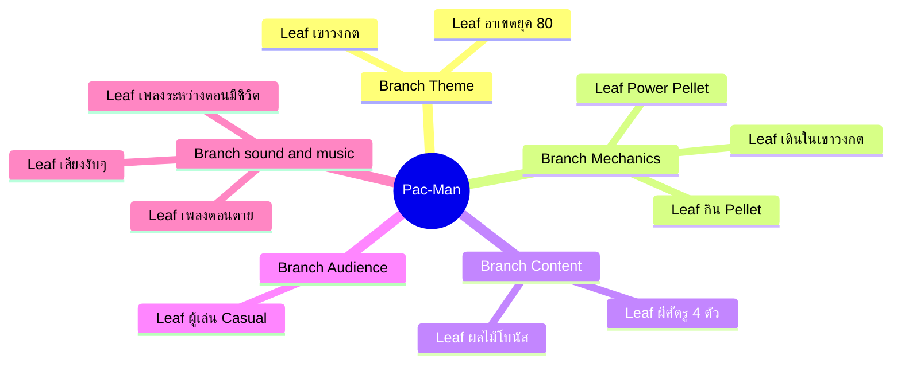
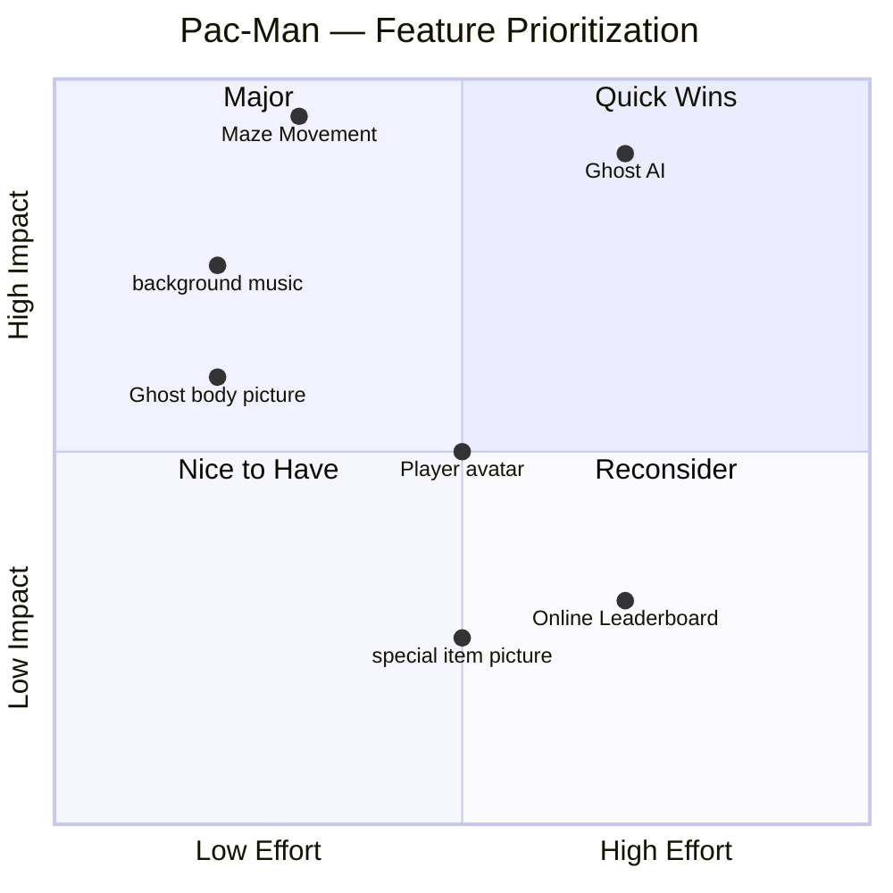
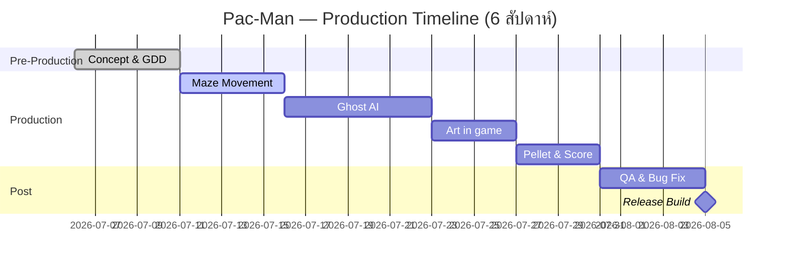

```mermaid
mindmap
		root((Pac-Man))
			Branch Theme
				Leaf เขาวงกต
				Leaf อาเขตยุค 80
			Branch Mechanics
				Leaf เดินในเขาวงกต
				Leaf กิน Pellet
				Leaf Power Pellet
			Branch Content
				Leaf ผีศัตรู 4 ตัว
				Leaf ผลไม้โบนัส
			Branch Audience
				Leaf ผู้เล่น Casual
			Branch sound and music
				Leaf เพลงตอนตาย
				Leaf เพลงระหว่างตอนมีชีวิต
				Leaf เสียงงับๆ
```

```mermaid
quadrantChart
title Pac-Man — Feature Prioritization
x-axis Low Effort --> High Effort
y-axis Low Impact --> High Impact
quadrant-1 Quick Wins
quadrant-2 Major
quadrant-3 Nice to Have
quadrant-4 Reconsider
Maze Movement: [0.3, 0.95]
Ghost AI: [0.7, 0.9]
Online Leaderboard: [0.7, 0.3]
Ghost body picture: [0.2, 0.6]
Player avatar: [0.5, 0.5]
background music: [0.2, 0.75]
special item picture: [0.5, 0.25]
```

```mermaid
gantt
title Pac-Man — Production Timeline (6 สัปดาห์)
dateFormat YYYY-MM-DD
section Pre-Production
Concept & GDD :done, c1, 2026-07-06, 5d
section Production
Maze Movement :active, p1, after c1, 5d
Ghost AI : p2, after p1, 7d
Art in game : p3, after p2, 3.5d
Pellet & Score : p4, after p3, 3.5d
section Post
QA & Bug Fix : q1, after p4, 5d
Release Build :milestone, m1, after q1, 0d
```
